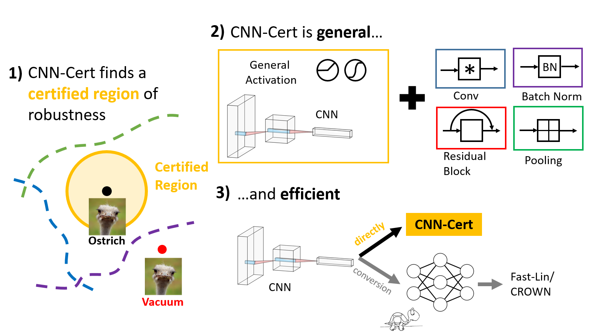

What's New
=====================================
* Added links to Medium post and video summarizing this work

Overview
=====================================
Please refer to [this post](https://medium.com/@MITIBMLab/cnn-cert-a-certified-measure-of-robustness-for-convolutional-neural-networks-fd2ff44c6807) for an overview of recent robustness evaluation algorithms and our contributions. We provide a video summary of this work [here](https://www.youtube.com/watch?v=Sz9I_zE4jto).




About CNN-Cert
=====================================
CNN-Cert is a general and efficient framework for certifying the robustness of convolutional neural networks (CNN). 
* CNN-Cert is **general**: it is able to certify lower bounds on the minimum adversarial distortion for a variety of CNNs with general activations (ReLU, tanh, sigmoid, arctan, etc), including those with convolutional layers, pooling layers, residual layers and batch-norm layers. In addition, it is a generalized version of previous robustness certification algorithms [Fast-Lin](https://arxiv.org/pdf/1804.09699.pdf) and [CROWN](https://arxiv.org/pdf/1811.00866.pdf) which focus on pure fully-connected networks with ReLU and general activations.   

* CNN-Cert is also **efficient**: it exploits convolutional structure to produce bounds more efficiently than comparable certification methods. We observed in our experiments that CNN-Cert achieves up to 17 and 11 times of speed-up compared to Fast-Lin and CROWN, and up to 366 times of speed-up compared to the dual-LP-based verification methods (see Tables 3-13 in our paper) while CNN-Cert obtains similar or even better robustness certificates (a.k.a. certified lower bounds).

Cite our work:

Akhilan Boopathy, Tsui-Wei Weng, Pin-Yu Chen, Sijia Liu and Luca Daniel, "[**CNN-Cert: An Efficient Framework for Certifying Robustness of Convolutional
Neural Networks**](https://arxiv.org/pdf/1811.12395.pdf)", AAAI 2019.

```
@inproceedings{Boopathy2019cnncert,
  author = "Akhilan Boopathy AND Tsui-Wei Weng AND Pin-Yu Chen AND Sijia Liu AND Luca Daniel",
  title = "CNN-Cert: An Efficient Framework for Certifying Robustness of Convolutional
Neural Networks",
  booktitle = "AAAI",
  year = "2019",
  month = "Jan"
}
```


Setup
-----------------------

<!--- 1. The code is tested with python3 and TensorFlow v1.10 and v1.12 (TensorFlow v1.8 is not compatible). The following packages are required.

```
sudo apt-get install python3-pip python3-dev
sudo pip3 install --upgrade pip
sudo pip3 install pillow numpy scipy pandas h5py tensorflow numba posix_ipc matplotlib
```
(Akhilan: above doesn't work for me... pip3 seems to have [problem](https://github.com/pypa/pip/issues/5240))
what works for me is:
--->

1. The code is tested with python3 and TensorFlow v1.10 and v1.12 (TensorFlow v1.8 is not compatible). The following packages are required.
```
conda create --name cnncert python=3.6
source activate cnncert
conda install pillow numpy scipy pandas h5py tensorflow numba posix_ipc matplotlib
```

2. Please also install Gurobi, its associated python library [gurobipy](http://www.gurobi.com/downloads/get-anaconda) and its [license](http://www.gurobi.com/documentation/8.1/quickstart_windows/retrieving_and_setting_up_.html#section:RetrieveLicense) in order to run LP/Dual-LP methods.

```
conda config --add channels http://conda.anaconda.org/gurobi
conda install gurobi
```

3. Clone this repository:

```
git clone https://github.com/AkhilanB/CNN-Cert.git
cd CNN-Cert
```

4. Download the [pre-trained CNN models](https://www.dropbox.com/s/mhe8u2vpugxz5ed/models.zip?dl=0) used in the paper.
```
wget https://www.dropbox.com/s/mhe8u2vpugxz5ed/models.zip
unzip models.zip
```

5. Convert the pre-trained CNN models to MLP models (in order to compare with Fast-Lin)
```
python cnn_to_mlp.py
```
Converted model results are saved into `log_cnn2mlp_timestamp.txt`.

6. Ready to run CNN-Cert and reproduce the experiments and Tables 3-13 in our paper. 
```
python pymain.py
```
The default value of parameter `table` in the main function of `pymain.py` is set to 6, meaning to reproduce the Table 6 in the paper. In addition, `pymain.py` includes an interface to the main CNN-Cert evaluation functions. Comparison scripts to run other methods including Fast-Lin, LP, CLEVER and attack methods are also included.

Results of robustness certificate and runtime are saved into `log_pymain_{timestamp}.txt`; example format of log file of Table 6 (partial):
```
Table 6 result
-----------------------------------
CNN-Cert-relu
model name = models/mnist_resnet_2, numimage = 10, norm = i, targettype = random
avg robustness = 0.01832
avg run time = 1.54 sec
-----------------------------------
CNN-Cert-Ada, ReLU activation
model name = models/mnist_resnet_2, numimage = 10, norm = i, targettype = random
avg robustness = 0.01971
avg run time = 1.56 sec
-----------------------------------
CNN-Cert-Ada, Sigmoid activation
model name = models/mnist_resnet_2, numimage = 10, norm = i, targettype = random
avg robustness = 0.00597
avg run time = 1.60 sec
```

How to Run
--------------------
We have provided a interfacing file `pymain.py` to compute certified bounds. This file contains a function `run_cnn` that computes CNN-Cert bounds and runtime averaged over a given number of samples.
```
Usage: run_cnn(file_name, n_samples, norm, core, activation, cifar)
```
* file_name: file name of network to certify
* n_samples: number of samples to certify
* norm: p-norm, 1,2 or i (infinity norm)
* core: True or False, use True for networks with only convolution and pooling
* activation: followed by a activation function of network- use ada for adaptive relu bounds (relu, ada, tanh, sigmoid or arctan)
* cifar: True or False, uses MNIST if False

The main CNN-Cert functions are included in `cnn_bounds_full.py` and `cnn_bounds_full_core.py`. `cnn_bounds_full_core.py` is for CNNs with just convolution and pooling layers, while `cnn_bounds_full.py` can be used for more general CNNs such as Resnets. The main Fast-Lin files are `main.py`, which implements ordinary Fast-Lin, and `main_sparse.py`, which implements a sparse matrix version of Fast-Lin. Please note that Fast-Lin and CNN-Cert may yield slightly different bounds on the same network due to implementation differences. CNN-Cert uses 15 steps of binary search to find a certified bound while Fast-Lin may use less than 15 steps.

Training your own models and evaluating CNN-Cert and other methods
-----------------------
0. We provide pre-trained models [here](https://www.dropbox.com/s/mhe8u2vpugxz5ed/models.zip?dl=0). The pre-trained models use the follwing naming convention:

Pure CNN Models:
```
{dataset}_cnn_{number of layers}layer_{filter size}_{kernel size}[_{non ReLU activation}]
Example: mnist_cnn_4layer_10_3
Example: cifar_cnn_5layer_5_3_tanh
```

General CNN Models:
```
{dataset}_cnn_{number of layers}layer[_{non ReLU activation}]
Example: mnist_cnn_7layer
Example: mnist_cnn_7layer_tanh
```

Fully connected Models:
```
{dataset}_{number of layers}layer_fc_{layer size}
Example: mnist_2layer_fc_20
```

Resnet Models:
```
{dataset}_resnet_{number of residual blocks}[_{non ReLU activation}]
Example: mnist_resnet_3
Example: mnist_resnet_4_tanh
```
LeNet Models:
```
{dataset}_cnn_lenet[_nopool][_{non ReLU activation}]
Example: mnist_cnn_lenet_tanh
Example: mnist_cnn_lenet_nopool
```


1. To train new models, we provide the following scripts: `train_cnn.py`,`train_lenet.py`,`train_nlayer.py`,`train_resnet.py`.

Models will be stored in the `models` folder. All models are trained and stored with Keras. To train your own model, call the training function in the appopriate file. For example, to train a 4-layer CNN trained on MNIST for 10 epochs with 5 filters per layer and 3x3 filters, run:
```
from train_cnn import train
from setup_mnist import MNIST
train(MNIST(), file_name='models/mnist_cnn_4layer_5_3', filters=[5,5,5], kernels = [3,3,3], num_epochs=10)
```
2. In order to run Fast-Lin and LP methods, convert the network to MLP using the `convert` function in `cnn_to_mlp.py`:
```
convert('models/mnist_cnn_4layer_5_3', 'models/mnist_cnn_as_mlp_4layer_5_3', cifar=False)
```

3. Evaluate the saved model `models/mnist_cnn_4layer_5_3` and compare with the methods reported in the paper: CNN-Cert, Fast-Lin, LP, Global Lipschitz, CLEVER, and CW/EAD attack (interface found in `pymain.py`). 

* If you want to run `CNN-Cert-ReLU` on one image:
```
run_cnn('models/mnist_cnn_4layer_5_3', 1, 'i', True, 'relu', False)
```
* If you want to run `CNN-Cert-Ada` on the same model
```
run_cnn('models/mnist_cnn_4layer_5_3', 1, 'i', True, 'relu', False)
```
* If you want to run `Fast-Lin` on one image (the first argument is not used if `layers` is provided)
```
run(999, 4, 1, 'i', 'models/mnist_cnn_as_mlp_4layer_5_3', [3380, 2880, 2420], cifar=False)
```
* If you want to run the sparse version of `Fast-Lin` on one image
```
run(999, 4, 1, 'i', 'models/mnist_cnn_as_mlp_4layer_5_3', [3380, 2880, 2420], sparse=True, cifar=False)
```
* If you want to run LP on one image
```
run(999, 4, 1, 'i', 'models/mnist_cnn_as_mlp_4layer_5_3', [3380, 2880, 2420], lp=True, cifar=False)
```
* If you want to run Global Lipschitz on one image
```
run(999, 4, 1, 'i', 'models/mnist_cnn_as_mlp_4layer_5_3', [3380, 2880, 2420], spectral=True, cifar=False)
```
* If you want to run CW/EAD attack on one image
```
with K.get_session() as sess:
    run_attack('models/mnist_cnn_4layer_5_3', sess)
```
* If you want to run Reluplex, first convert the MLP network to nnet format using `ReluplexCav2017/to_nnet.py`:
```
nnet('models/mnist_cnn_as_mlp_4layer_5_3')
```
The resulting file will be saved as `models/mnist_cnn_as_mlp_4layer_5_3.nnet`. Move this file to `ReluplexCav2017/nnet/`. Edit `ReluplexCav2017/check_properties/adversarial/main.cpp` to change the images verified. Then run
```
./ReluplexCav2017/scripts/run_adversarial.sh
```

Additional Examples
----------------

For example, to compute the average l-infinity CNN-Cert bound over 100 images on a MNIST pure convolutional ReLU network with filename `my_mnist_network`, run the following in python:

```
from pymain import run_cnn
bound, time = run_cnn('my_mnist_network', 100, 'i')
```
To find the Fast-Lin bounds on this network, first convert the network to MLP:
```
from cnn_to_mlp import convert
convert('my_mnist_network', 'my_mlp_mnist_network')
```
This will print the size of the MLP weight matrices. Use this to determine the number of nodes in each hidden layer of the MLP network. Suppose there are 3 hidden layers (4 layers total excluding the input) with 50 nodes each.

To run Fast-Lin, call the Fast-Lin interfacing function in `pymain.py`:
```
from pymain import run
bound, time = run(50, 4, 'i', 'my_mlp_mnist_network')
```
To compute the average l-2 CNN-Cert bound over 10 images on a CIFAR sigmoid Resnet with filename `my_cifar_resnet`, run the following in python:
```
from pymain import run_cnn
bound, time = run_cnn('my_cifar_resnet', 10, '2', core = False, activation = 'sigmoid', cifar = True)
```

Experimental Results
----------------
Results of running CNN-Cert are shown for some example networks with different perturbation norms. CNN-Cert is compared to other certified bounds in both bounds and runtimes. As illustrated, for the example networks CNN-Cert performs similar to or better than the compared methods with faster runtime.


